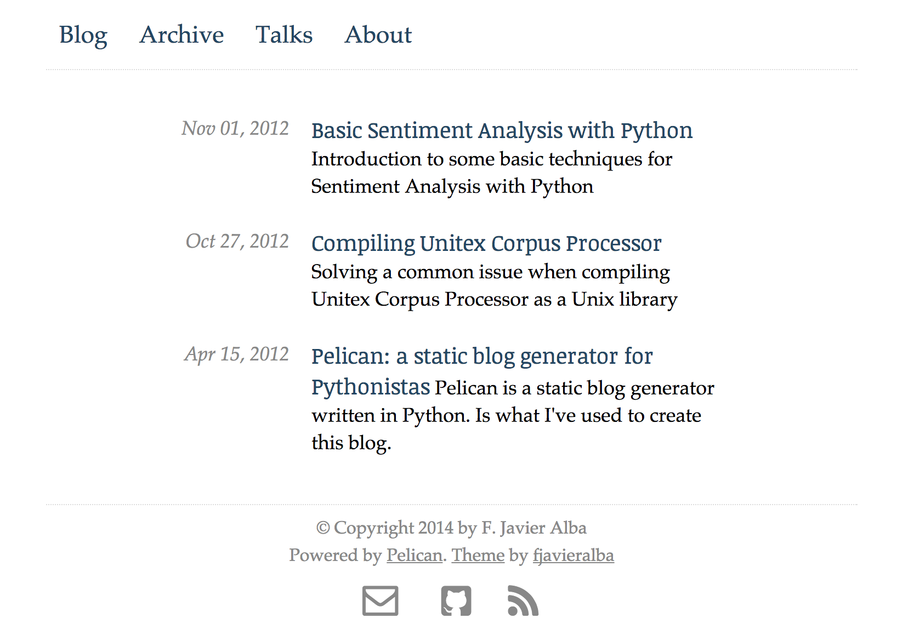

flasky
======

Minimalist Pelican theme

Installing flasky
-----------------

  1) Install Pelican as described `here <http://pelican.readthedocs.org/en/3.4.0/install.html>`_.

  2) Get flasky code

    If you are using git::
    
      git clone https://github.com/fjavieralba/flasky.git

    If not, download from https://github.com/fjavieralba/flasky/releases

  3) Install the theme using the `pelican-themes` tool included with pelican. For example, if you downladed flasky in ./flasky::

      pelican-themes -i ./flasky

Configuration
-------------

You need some content to apply the theme to. I recomend you using `the Pelican quick-start guide <http://pelican.readthedocs.org/en/3.4.0/quickstart.html#create-a-project>`_ if you still don't have any content.

After following the quickstart instructions you will have a new folder containing your content a pelicanconf.py config file.

Edit this file in order to add the variables that flasky expects. These settings are the following::

+------------+------------+-----------+ 
| Variable   | Type       |Description| 
+============+============+===========+ 
| SECTIONS   | Mandatory  | A list of tuples  | 
+------------+------------+-----------+ 
| body row 2 | Cells may span columns.| 
+------------+------------+-----------+ 
| body row 3 | Cells may  | - Cells   | 
+------------+ span rows. | - contain | 
| body row 4 |            | - blocks. | 
+------------+------------+-----------+

An example of a pelicanconf.py is the following (Note that we are using relative URLs, so `RELATIVE_URLS = True`) 

    #!/usr/bin/env python
    # -*- coding: utf-8 -*- #
    from __future__ import unicode_literals

    AUTHOR = u'Your Name'
    SITENAME = u'Your site name'
    SITEURL = ''

    PATH = 'content'

    TIMEZONE = 'Europe/Madrid'

    DEFAULT_LANG = u'en'

    # Feed generation is usually not desired when developing
    FEED_ALL_ATOM = None
    CATEGORY_FEED_ATOM = None
    TRANSLATION_FEED_ATOM = None

    # Blogroll
    LINKS = (('Pelican', 'http://getpelican.com/'),
             ('Python.org', 'http://python.org/'),
             ('Jinja2', 'http://jinja.pocoo.org/'),
             ('You can modify those links in your config file', '#'),)

    # Social widget
    SOCIAL = (('You can add links in your config file', '#'),
              ('Another social link', '#'),)

    DEFAULT_PAGINATION = 10

    # Uncomment following line if you want document-relative URLs when developing
    #RELATIVE_URLS = True

    #####  VARIABLES ADDED FOR FLASKY USAGE: #####

    SITESUBTITLE = "my subtitle"

    #Navigation sections and relative URL. This will be used for NavBar links:
    SECTIONS = [('Blog', 'index.html'),
                ('Archive', 'archives.html'),
                ('Talks', 'pages/talks.html'),
                ('About', 'pages/about-me.html')]

    DEFAULT_CATEGORY = 'Uncategorized'
    DATE_FORMAT = {
    'en': '%d %b %Y'
    }
    DEFAULT_DATE_FORMAT = '%d %b %Y'

    #Social accounts. Will be used in the contact info at the footer:
    TWITTER = {'enabled': True, 'url': 'http://twitter.com/fjavieralba'}
    LINKEDIN = {'enabled': True, 'url': 'http://es.linkedin.com/in/fjavieralba/en'}
    GITHUB = {'enabled': True, 'url': 'http://github.com/fjavieralba'}
    FACEBOOK = {'enabled': False, 'url': None}
    GOOGLEPLUS = {'enabled': False, 'url': None}
    PINTEREST = {'enabled': False, 'url': None}

    #Email contact info:
    MAIL_USERNAME = 'me'
    MAIL_HOST = 'fjavieralba.com'

    #Disqus comments:
    DISQUS_SITENAME = "fjavieralba"

    PDF_GENERATOR = False
    REVERSE_CATEGORY_ORDER = True
    LOCALE = ""
    DEFAULT_PAGINATION = 10

    FEED_RSS = 'feeds/all.rss.xml'
    CATEGORY_FEED_RSS = 'feeds/%s.rss.xml'

    THEME = 'flasky'
    OUTPUT_PATH = '/Users/fjavieralba/Developer/github/fjavieralba.com/'

    GOOGLE_ANALYTICS_ACCOUNT = 'UA-30867493-1'

    # static paths will be copied under the same name
    STATIC_PATHS = ["images"]
    

Generating your site with Flasky theme
--------------------------------------

Once you have edited your pelican configuration, you can generate your site with the following command:

    cd /your/content/folder

    pelican ./content -s pelicanconf.py -t flasky -o output

After running this command, you should have an output directory containing your static site. Open output/index.html in a browser to check how your site looks like.

More info
---------

Pelican is a well documented project. I encourage you to visit http://docs.getpelican.com.

Sections `settings <http://pelican.readthedocs.org/en/3.4.0/settings.html>`_ and `Creating Themes <http://pelican.readthedocs.org/en/3.4.0/themes.html>`_ are specially worth a visit.

Hope you enjoy this theme!

